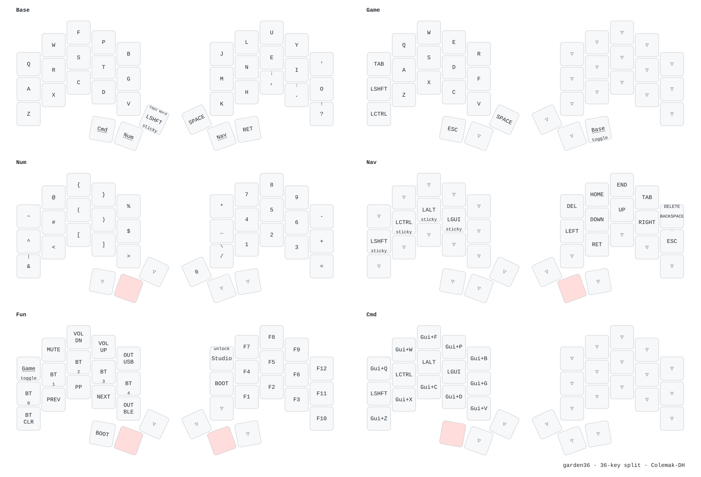

# garden36 ZMK config

ZMK firmware for the [garden36](https://github.com/shnaps/garden36), a 36-key wireless split keyboard.
Each half runs a nice!nano v2 with a nice!view display.
The base layer is Colemak-DH.

## Layers

| Layer | How to reach it | What it holds |
|---|---|---|
| Base | Default | Colemak-DH letters, punctuation, Space, Enter |
| Num | Hold the left middle thumb | Numpad on the right, brackets and symbols on the left |
| Nav | Hold the right middle thumb | Arrows, Home, End, Tab, Backspace/Delete, sticky mods on the left |
| Fun | Hold both middle thumbs | F1–F12, media, Bluetooth profiles, USB/BLE output, bootloader, Studio unlock |
| Cmd | Hold the left outer thumb | Cmd+letter shortcuts on the left, plain mods on the home row |
| Game | Tap the top-left key on Fun | WASD block with Shift and Ctrl on the left. Tap the right outer thumb to leave |

## Keys that do two things

The left inner thumb (`&smart_shft`) is a sticky Shift for the next key. Tap it twice for Caps Word.

| Key | Tap | With Shift |
|---|---|---|
| `&comma_semi` | `,` | `;` |
| `&dot_colon` | `.` | `:` |
| `&qmrk_excl` | `?` | `!` |
| `&bspc_del` (Nav) | Backspace | Delete |
| `&slh_morph` (Num) | `/` | `\` |
| `&amps_morph` (Num) | `&` | `\|` |

## Build

GitHub Actions builds on every push (`.github/workflows/build.yml`, targets in `build.yaml`).
Download the `firmware` artifact from the run. It holds 3 files:

- `garden36_left nice_view_adapter nice_view-nice_nano_v2-zmk.uf2`: the left half. It is the central, so it connects to the computer and runs ZMK Studio.
- `garden36_right nice_view_adapter nice_view-nice_nano_v2-zmk.uf2`: the right half.
- `settings_reset-nice_nano_v2-zmk.uf2`: clears pairings and saved settings.

ZMK is pinned to `v0.3` in `config/west.yml`.

## Flash

1. Connect one half over USB.
2. Double-tap reset on that half's nice!nano, or press that half's BOOT key on the Fun layer. A drive named `NICENANO` appears.
3. Copy that half's `.uf2` file to the drive. The half reboots when the copy finishes.
4. Repeat for the other half.

After a `settings_reset`, flash both halves again, then reset them at the same time so they pair with each other.

## ZMK Studio

The left half builds with Studio over USB. Studio stays locked until you press Studio unlock on the Fun layer.

## Keymap image

`draw/render.sh` redraws `draw/garden36.svg` from `config/garden36.keymap` with [keymap-drawer](https://github.com/caksoylar/keymap-drawer).
It needs [uv](https://docs.astral.sh/uv/). Run it after each keymap change and commit the new SVG.

## Layout

| Path | Contents |
|---|---|
| `config/garden36.keymap` | Layers and behaviors |
| `config/garden36.conf` | Settings for both halves |
| `config/garden36_left.conf` | Settings for the left half only: Studio, battery reporting |
| `boards/shields/garden36/` | Shield definition: matrix pins, physical layout |
| `draw/` | keymap-drawer config and output |
